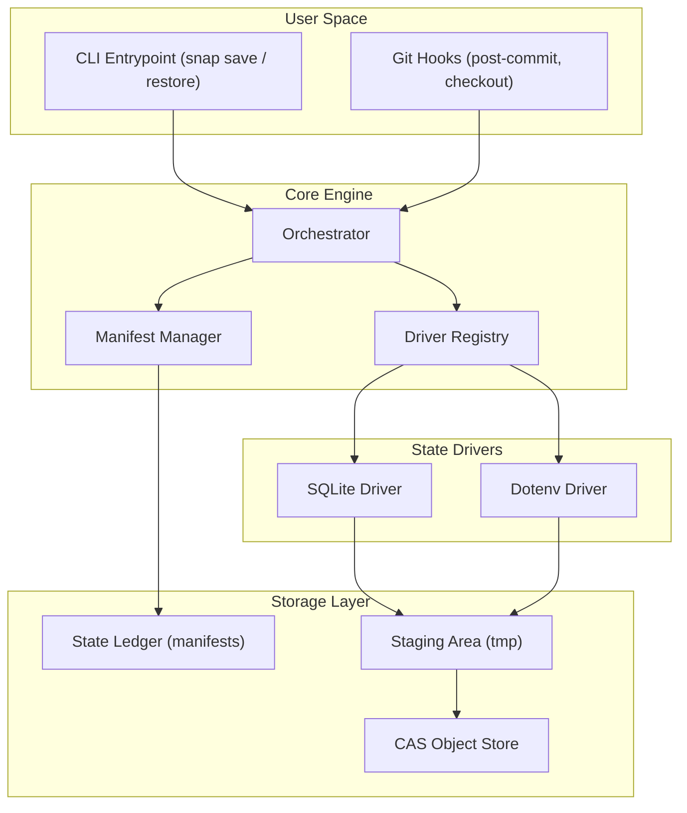

# Snap-CLI

State-aware checkpoints for AI coding agents (and humans).

Ever used an AI coding agent, let it run for a while, realized it messed up, and ran `git checkout HEAD~5` to revert the code? If you have, you probably noticed that while your code reverted, your database and your `.env` file didn't. 

Now your code expects one thing, but your database is in the future. This is called Agentic Drift, and it's super annoying to debug. 

Snap fixes this. It quietly hooks into Git so that whenever you change branches or checkout an old commit, it automatically restores your local databases and config files to match exactly how they were at that specific commit.

## How it works

The philosophy is simple: the Git commit hash should be the single source of truth for your entire system.

### Visual Architecture



When you initialize Snap in a repository, it drops a small script into your native Git hooks:
- When you run `git commit`, Snap quietly streams your state (like a local SQLite DB or an env file) into a hidden content-addressable store (`.snap/objects`).
- When you run `git checkout`, Snap grabs the data associated with that checkout and puts it right back where it belongs.

I wrote this in pure Go with zero CGO dependencies (so it cross-compiles everywhere). The backing store does zero-cost deduplication, meaning if your database didn't actually change between commits, Snap doesn't duplicate the storage. It also streams everything through a tiny 32KB buffer, so it uses practically zero RAM even if you are tracking massive gigabyte-level databases.

## What it actually works with

Right now, Snap is built specifically for **local development environments**. The entire reason Snap exists is strictly for files that you cannot or should not track with Git natively (like secrets or giant binary databases). 

Because of this, you should NOT use Snap to track source code (`.ts`, `.py`, `.go`). Git already handles those perfectly! I built Snap to act as Git's sidekick, handling the heavy local files that it purposefully ignores:

* **.env files**: Fully supported. Snap captures them perfectly.
* **SQLite databases**: Fully supported for local dev. Right now Snap uses a blazing-fast file-copy mechanism under the hood. It takes a perfect snapshot of your `.sqlite` or `.db` file in milliseconds and streams it to the storage engine. (Just don't try to use it on a live production SQLite database that is taking 5,000 requests a second, it's not meant for that!).

**What it DOES NOT support (yet):**
* PostgreSQL, MySQL, Redis, or Mongo.
* Cloud-hosted databases. Snap physically cannot rewind your AWS RDS instance (and you probably wouldn't want it to!).
* `node_modules` or large dependency folders. Don't do this! Just commit your `package-lock.json` and run `npm install` after checkout instead.

Snap is purely for keeping your *local* environment perfectly synced with your *local* Git repository while you hack away or let an AI agent generate code. Building native driver hooks for local Docker Postgres/Redis instances is definitely on the roadmap!

## Installation

You need Go installed on your machine. Then run:

```bash
go install github.com/NishthaNabya/Snap-CLI/cmd/snap@v0.1.0
```

This will install a binary called `snap` on your system. You will always type `snap` in the terminal, not `Snap-CLI`.

Works on **Mac, Linux, and Windows**.

## Quick start

Go to any existing git repository and run:

```bash
snap init
```

This creates a `.snap/` directory and installs Git hooks. Now open `.snap/config.json` and tell Snap what to track.

**If you only want to track your `.env` file:**
```json
{
  "entries": [
    {
      "driver": "dotenv",
      "source": ".env"
    }
  ]
}
```

**If you only want to track a SQLite database:**
```json
{
  "entries": [
    {
      "driver": "sqlite",
      "source": "database.sqlite"
    }
  ]
}
```

**If you want both tracked at the same time:**
```json
{
  "entries": [
    {
      "driver": "dotenv",
      "source": ".env"
    },
    {
      "driver": "sqlite",
      "source": "database.sqlite"
    }
  ]
}
```

> [!WARNING]
> **CRITICAL SECURITY NOTE:** Snap stores copies of your `.env` files and databases locally inside `.snap/objects/`. You **MUST** add the storage directories to your `.gitignore` file. If you don't, you will accidentally push your secret API keys to GitHub!
>
> Add this to your `.gitignore`:
> ```text
> .snap/objects/
> .snap/manifests/
> .snap/tmp/
> .snap/snap.lock
> ```
> *(It is perfectly safe to commit `.snap/config.json` so your team shares the same tracking config!)*

## How to actually use it

After setup, you don't type any special Snap commands. You just use Git like you always do. Snap runs silently in the background.

**Step 1: Make changes and commit normally.**
```bash
# Create or edit your .env file (use your editor, or the terminal)
echo "SECRET=hello123" > .env

git add .
git commit -m "my changes"
```
When you commit, Snap's `post-commit` hook fires automatically and quietly backs up your `.env` (and/or database) in the background.

**Step 2: Make more changes and commit again.**
```bash
echo "SECRET=changed456" > .env
git commit -am "updated secret"
```
Snap silently takes another snapshot tied to this new commit.

**Step 3: When you want to revert, use `git checkout`.**

This is the key part. To go back in time, you run a standard Git checkout command:

```bash
# Go back exactly 1 commit
git checkout HEAD~1

# Or go back 3 commits
git checkout HEAD~3

# Or jump to a specific commit hash
git checkout abc1234
```

When you do this, Git reverts your code, and Snap automatically reverts your `.env` file and database to match.

**To go back to where you were:**
```bash
git checkout main
```

## Troubleshooting

**"snap: no snapshot for ... (this is normal for commits made before snap init)"**

This is not an error! It just means the commit you checked out was made *before* you installed Snap. Snap can only restore state for commits that happened *after* you ran `snap init`.

**"snap: warning: skipping .env (file not found)"**

This means you configured `.env` in your `.snap/config.json`, but you haven't actually created a `.env` file in your project yet. Snap will silently skip it and continue. Once you create the file and commit, Snap will start tracking it automatically.

**"nothing to commit, working tree clean" (and Snap didn't save anything)**

Snap's hooks only fire when Git actually creates a commit. If Git says there is nothing to commit, Snap never runs. Make sure you have actual changes staged before committing.

**Installed Snap but gets an old version**

The Go module proxy sometimes caches old code. To force the latest version, run:
```bash
go install github.com/NishthaNabya/Snap-CLI/cmd/snap@v0.1.0
```
If you had a previous version, you might need to clear the cache first:
```bash
go clean -cache
go install github.com/NishthaNabya/Snap-CLI/cmd/snap@v0.1.0
```

## Contributing to Snap

If you're a fellow developer looking to contribute to Snap, here are some of the biggest features currently on the roadmap that I would love your help with!

* **Generic File Driver:** A driver to snap completely arbitrary single files (like a massive `dataset.csv` or `config.xml`) that shouldn't be in Git.
* **Native SQLite Backup API:** Right now, the SQLite driver uses a file-copy mechanism. This is perfectly safe for local dev, but for concurrent access, swapping this to the native Go SQLite Backup API (`zombiezen.com/go/sqlite`) would make it bulletproof.
* **Docker / Cloud DB Hooks:** Building drivers capable of sending snapshot commands to a local PostGres Docker container or a local Redis instance before committing.
* **Encryption at Rest:** Adding AES encryption to the `.snap/objects` blobs if you want to store your local secrets more securely!

If you have any other cool ideas, feel free to fork the repo and open a new Pull Request!
