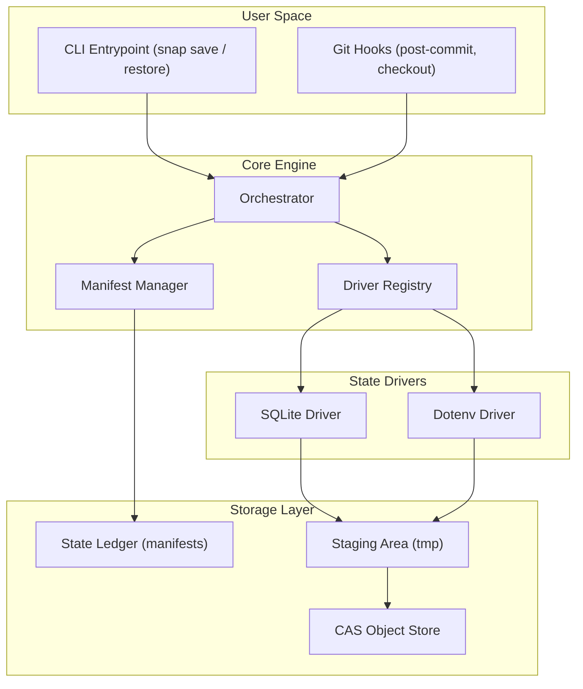

# snap

State-aware checkpoints for AI coding agents (and humans).

Ever used an AI coding agent, let it run for a while, realized it messed up, and ran `git checkout HEAD~5` to revert the code? If you have, you probably noticed that while your code reverted, your database and your `.env` file didn't. 

Now your code expects one thing, but your database is in the future. This is called Agentic Drift, and it's super annoying to debug. 

Snap fixes this. It quietly hooks into Git so that whenever you change branches or checkout an old commit, it automatically restores your local databases and config files to match exactly how they were at that specific commit.

## How it works

The philosophy is simple: the Git commit hash should be the single source of truth for your entire system.

### Visual Architecture



When you initialize Snap in a repository, it drops a small script into your native Git hooks:
- When you run `git commit`, Snap quietly streams your state (like a local SQLite DB or an env file) into a hidden content-addressable store (`.snap/objects`).
- When you run `git checkout`, Snap grabs the data associated with that checkout and puts it right back where it belongs.

I wrote this in pure Go with zero CGO dependencies (so it cross-compiles everywhere). The backing store does zero-cost deduplication, meaning if your database didn't actually change between commits, snap doesn't duplicate the storage. It also stream everything through a tiny 32KB buffer, so it uses practically zero RAM even if you are tracking massive gigabyte-level databases.

### Driver Status & Roadmap
- **Dotenv**: Fully supported.
- **SQLite**: Supported via a file-copy mechanism. This is perfectly safe for local dev environments where only one agent/developer is writing to the DB at a time. *Roadmap: We plan to integrate the native Go SQLite Backup API (`zombiezen.com/go/sqlite`) for consistent hot-backups on concurrent databases.*

## Installation

You just need Go installed on your machine. Run:

```bash
go install github.com/NishthaNabya/snap/cmd/snap@latest
```

## Quick start

Go to any existing git repository and run:

```bash
snap init
```

This creates a `.snap/config.json` file. Edit it to tell Snap what files to track. For example, if you want local environments and a sqlite database tracked:

```json
{
  "entries": [
    {
      "driver": "dotenv",
      "source": ".env"
    },
    {
      "driver": "sqlite",
      "source": "database.sqlite"
    }
  ]
}
```

That's literally it. You don't need to learn any new CLI commands. Just use Git like you always do.

```bash
# Make a change to your env
echo "SECRET=123" > .env
git add .env
git commit -m "added a secret"
# (Snap quietly backed up your .env in the background)

# Change it again
echo "SECRET=456" > .env
git commit -am "changed the secret"

# Watch Snap automatically revert your .env file on disk!
git checkout HEAD~1
```
